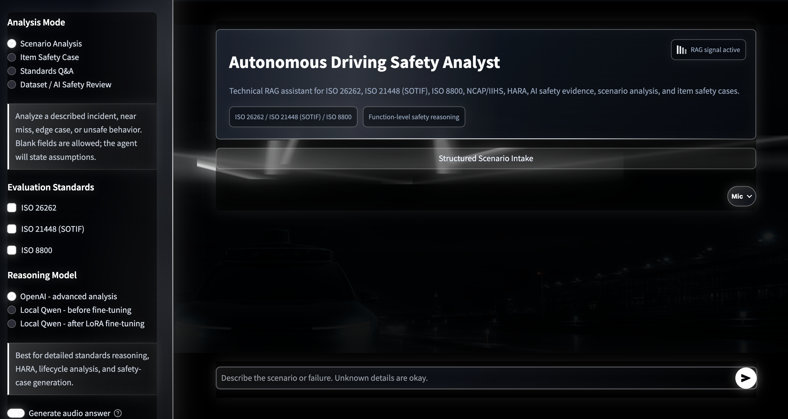
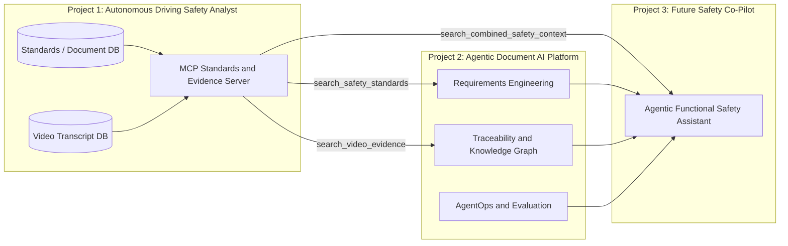
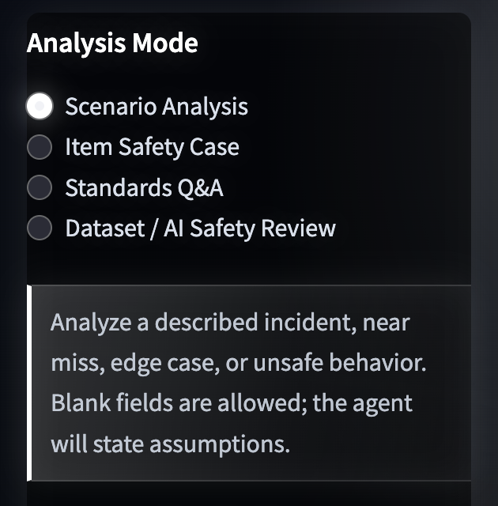
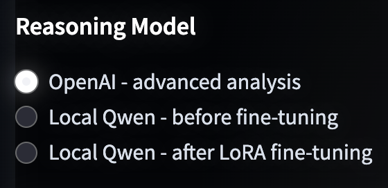
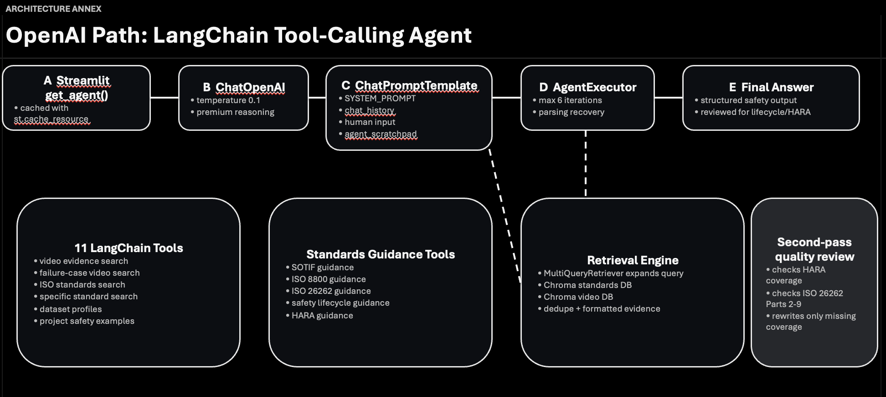
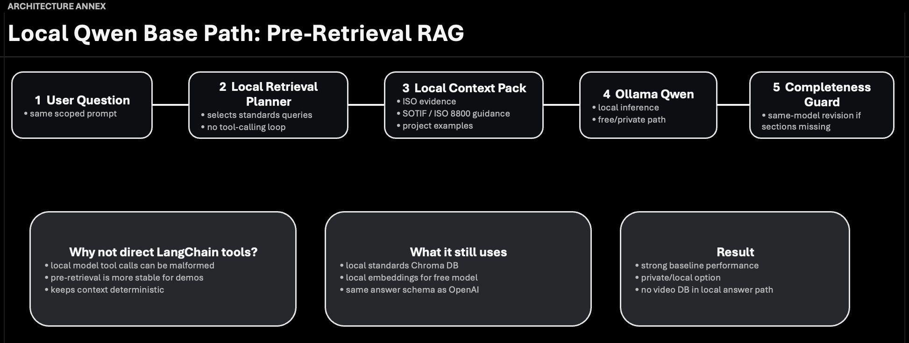
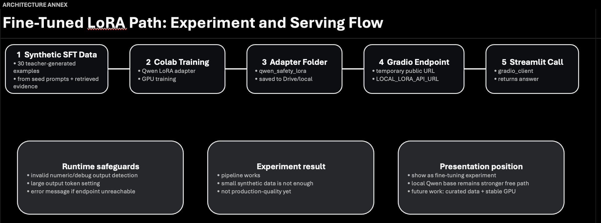

# Autonomous Driving Safety Analyst

LLM-based safety analysis assistant for autonomous driving and ADAS engineering. The system combines Retrieval-Augmented Generation (RAG), ISO standards retrieval, video-evidence retrieval, speech input, multiple model backends, automated evaluation, and containerized local deployment.

It is designed to support technical safety-case work products such as HARA screening, ISO 26262 lifecycle analysis, ISO 21448 (SOTIF) reasoning, ISO 8800 AI assurance, V&V planning, and evidence-based engineering recommendations.

## Demo

A short demo video is available here:

[Watch the demo video on Google Drive](https://drive.google.com/file/d/1k46pW3LE86S-YYYViGXYWVvYZTCWSFMo/view?usp=drive_link)

The app was successfully containerized and tested on AWS ECS/Fargate during development. The cloud deployment has since been removed to avoid ongoing AWS costs; the project is currently intended to run locally or from a fresh container build.

## Key features

- Streamlit chat interface for safety analysis, standards Q&A, item safety cases, and dataset/AI safety review.
- RAG over ISO 26262, ISO 21448 (SOTIF), ISO 8800, dataset profiles, project examples, and video transcripts.
- LangChain/OpenAI tool-calling agent with specialized retrieval tools and lifecycle completeness review.
- Optional local Qwen path through Ollama for private/local draft generation.
- Experimental Qwen LoRA fine-tuning workflow trained on synthetic safety-case examples.
- Speech-to-text input and optional fixed-voice audio output.
- Embedded video-evidence playback with timestamped retrieval context.
- Railway RAMS educational-context support through local Whisper transcripts
  from public IEC 62278 / EN 50126 lecture audio.
- Read-only MCP server exposing the standards/document and video transcript
  vector databases as reusable retrieval tools for future agentic projects.
- Optional conversation memory API for storing conversation modes, selected
  standards, model choices, user/assistant messages, and retrieved-source
  summaries.
- Automated model evaluation with benchmark questions, random automotive systems, rubric scoring, hallucination checks, CSV/Markdown reports, and plots.
- Dockerized runtime for local/container deployment, with AWS ECS/Fargate used previously as a validation experiment.

---

## Project structure

```
Autonomous_Driving_Safety_Analyst/
│
├── config.py                    # Centralised settings (loaded from .env)
├── ingest_all.py                # Master runner — executes both pipelines
├── mcp_server.py                # Read-only MCP tools over standards/video DBs
├── conversation_api.py          # Optional FastAPI conversation memory service
├── requirements.txt
├── .env.example                 # Copy to .env and fill in your keys
│
├── ingestion/
│   ├── video_ingestion.py        # YouTube/local transcripts → Chroma video DB
│   ├── standards_ingestion.py    # ISO/docs → Chroma standards DB
│   └── whisper_transcription.py  # Optional local Whisper transcription helper
│
├── agent/                        # LangChain/OpenAI + local model orchestration
│
├── utils/
│   └── db_inspector.py         # Inspect & test both vector DBs
│
├── standards_pdfs/              # Place your ISO PDF files here
│   ├── iso_26262_part1.pdf
│   ├── iso_26262_part4.pdf
│   ├── iso_21448_sotif.pdf
│   └── iso_8800.pdf
│
└── vectordb/                    # Auto-created by Chroma
    ├── video_db/
    └── standards_db/
```

---

## Setup

### 1. Install dependencies

```bash
python -m venv .venv
source .venv/bin/activate        # Windows: .venv\Scripts\activate
pip install -r requirements.txt
```

### 2. Configure environment

```bash
cp .env.example .env
# Edit .env and add at least OPENAI_API_KEY
```

Notes:
- `OPENAI_API_KEY` is required for OpenAI reasoning, OpenAI embeddings, and OpenAI TTS.
- `LANGCHAIN_API_KEY` is optional and only needed if you want LangSmith tracing.

### 3. Add ISO standard PDFs

Create the `standards_pdfs/` directory and place your PDF files inside.
The expected filenames are listed in `ingestion/standards_ingestion.py` under `STANDARD_DEFINITIONS`.
Any PDF not in the definition map will still be ingested with generic metadata.

```bash
mkdir standards_pdfs
# Copy your PDFs here:
# iso_26262_part1.pdf, iso_26262_part4.pdf, iso_21448_sotif.pdf, iso_8800.pdf ...
```

---

## Running the ingestion

### Ingest everything (videos + standards)

```bash
python ingest_all.py
```

### Ingest only one pipeline

```bash
python ingest_all.py --only videos
python ingest_all.py --only standards
```

### Reset and re-ingest from scratch

```bash
python ingest_all.py --reset
```

### Ingest a single video from the CLI

```bash
python -m ingestion.video_ingestion \
  --url "https://www.youtube.com/watch?v=xyz" \
  --channel "Waymo" \
  --category "perception"
```

### Ingest local lecture audio with Whisper

The project can also use local audio files when YouTube captions are missing.
This is useful for public railway RAMS lectures about IEC 62278 / EN 50126.

Place audio files in a local folder such as:

```text
railway_audio/
```

Use YouTube video IDs as filenames where possible:

```text
railway_audio/tcHg-fMVxr4.mp3
railway_audio/x2c4AP5ql-c.mp3
```

Then transcribe:

```bash
python -m ingestion.whisper_transcription --audio-dir railway_audio --model base
```

This writes local transcripts to:

```text
transcripts/{video_id}.txt
transcripts/{video_id}.vtt
```

After updating `videos.csv`, rebuild the video vector database:

```bash
python -m ingestion.video_ingestion --reset
```

Important framing:

```text
Railway lecture transcripts are used as public educational context for RAMS
concepts. They are not official IEC 62278 or EN 50126 standard text and should
not be presented as compliance evidence.
```

### Ingest specific standard PDFs

```bash
python -m ingestion.standards_ingestion \
  --pdf-dir ./standards_pdfs \
  --files iso_26262_part4.pdf iso_21448_sotif.pdf
```

---

## Inspecting the databases

```bash
# Print chunk counts for both DBs
python utils/db_inspector.py --stats

# Search the video DB
python utils/db_inspector.py --db videos --query "sensor fusion in fog"

# Search the standards DB
python utils/db_inspector.py --db standards --query "ASIL decomposition hardware"

# Filter standards search to a specific standard
python utils/db_inspector.py --db standards \
  --query "validation of ML models" \
  --filter "ISO 8800"
```

---

## MCP standards and evidence server

Project 1 can also run as a read-only MCP knowledge service. This lets Project
2 or a future Project 3 agentic co-pilot use the existing standards and video
databases without copying them into another repository.

The MCP server exposes these tools:

```text
get_knowledge_base_status
search_safety_standards
search_video_evidence
search_combined_safety_context
```

Recommended role in the full portfolio:

```text
Project 1: Standards and video-evidence knowledge service
Project 2: Document AI, requirements engineering, traceability, and AgentOps
Project 3: Agentic functional safety co-pilot that calls Project 1 and 2 tools
```



Run the MCP server locally:

```bash
python mcp_server.py
```

Test it with the MCP Inspector:

```bash
npx -y @modelcontextprotocol/inspector \
  .venv/bin/python mcp_server.py
```

Useful test queries:

```text
search_safety_standards:
  query = "What evidence is needed for ISO 26262 item definition and HARA?"
  standard = "ISO 26262"

search_video_evidence:
  query = "perception failure in rain or low visibility"
  failure_cases_only = true

search_combined_safety_context:
  query = "How should an ADAS system handle degraded perception at night?"
```

Notes:

- `search_safety_standards` can use `embedding_backend="openai"` or
  `embedding_backend="local"` if the local standards vector database was built.
- `search_video_evidence` uses the video transcript vector database and requires
  the OpenAI embedding setup used by the video ingestion pipeline.
- Railway lecture transcripts are educational context only and should not be
  presented as official IEC 62278 / EN 50126 standard text.

---

## Conversation memory API

Project 1 can run a lightweight conversation API alongside the Streamlit UI.
This keeps the first project focused as a knowledge assistant while still
supporting follow-up questions, selected standards, model mode, and retrieved
source summaries.

Endpoints:

```text
POST /conversations
GET  /conversations/{conversation_id}
POST /conversations/{conversation_id}/messages
GET  /conversations/{conversation_id}/history
```

Run it locally:

```bash
uvicorn conversation_api:app --reload --port 8010
```

Open:

```text
http://127.0.0.1:8010/docs
```

Conversation records are saved under `outputs/conversations/`, which is ignored
by git.

---

## Optional voice output


The terminal agent can save each answer as fixed-voice audio for local testing.
This is disabled by default. Voice output uses OpenAI TTS. Enable it in `.env`:

```bash
TTS_ENABLED=true
TTS_MODEL=tts-1
TTS_VOICE=alloy
TTS_OUTPUT_DIR=./outputs/tts
TTS_AUTOPLAY=false
```

On macOS, set `TTS_AUTOPLAY=true` to play the generated audio automatically
after each answer. Audio files are saved under `outputs/`, which is ignored by
git.

The voice is controlled by the project owner in `.env`; users do not choose or
upload voices in the current version.

---

## Running the web app

The project includes a Streamlit app with four workflows:


- Scenario Analysis
- Item Safety Case
- Standards Q&A
- Dataset / AI Safety Review

Run it locally:

```bash
source .venv/bin/activate
streamlit run app.py
```

Then open:

```text
http://127.0.0.1:8501
```

### Optional open-source draft model

The app includes a sidebar model selector:






- `OpenAI - advanced analysis`
- `Local Qwen - before fine-tuning`
- `Local Qwen - after LoRA fine-tuning`

The pre-fine-tuning local mode expects an Ollama-compatible local model by
default. It is intended for quick draft answers, not final engineering review.
This mode uses a separate local standards-only Chroma DB, so it does not
overwrite the OpenAI embedding databases.

The after-fine-tuning local mode expects a running LoRA inference endpoint. For
presentation demos, run `training/serve_qwen_lora_colab.py` in Colab and set
`LOCAL_LORA_API_URL` to the printed Gradio share URL.

Example local setup:

```bash
brew install ollama
ollama pull qwen2.5:7b-instruct
ollama serve
```

Build the local standards embedding DB once:

```bash
python -m ingestion.standards_ingestion --embedding-backend local --reset
```

The first run downloads the local embedding model configured by
`LOCAL_EMBEDDING_MODEL`. The default is `BAAI/bge-small-en-v1.5`, which is small
enough for local testing and keeps retrieval free after setup.

Then configure `.env` if you want to change the model, endpoint, or local
embedding store:

```bash
LOCAL_LLM_PROVIDER=ollama
LOCAL_LLM_BASE_URL=http://localhost:11434
LOCAL_LLM_MODEL=qwen2.5:7b-instruct
LOCAL_LLM_TIMEOUT=300
LOCAL_LLM_NUM_CTX=16384
LOCAL_LLM_NUM_PREDICT=4000
LOCAL_LORA_OLLAMA_MODEL=qwen-safety-lora
LOCAL_LORA_API_URL=
LOCAL_LORA_TIMEOUT=300
LOCAL_EMBEDDING_MODEL=BAAI/bge-small-en-v1.5
CHROMA_LOCAL_STANDARDS_DB_PATH=./vectordb/local_standards_db
LOCAL_STANDARDS_COLLECTION_NAME=local_iso_standards
```

Note: the open-source draft mode currently retrieves from standards and project
safety-case examples only. OpenAI mode still uses the existing OpenAI embeddings
and can use the standards, video, dataset, and example evidence already in your
main vector DBs.

---

## Running evaluations

### Standards evaluation (OpenAI + local models)

```bash
python evaluation/evaluate_models.py \
  --models openai local_base local_lora \
  --limit 2 \
  --random-cases 2 \
  --seed 42
```

### Video + standards evaluation (paid-path capability)

```bash
python evaluation/evaluate_video_standard.py
```

### Optional LoRA fine-tuning for the local model

The `training/` folder contains a Colab-ready workflow to make the local Qwen
model better at the project's answer style. It uses OpenAI as a teacher to
generate examples from local retrieved evidence, then fine-tunes Qwen with LoRA.

Start here:

```bash
python training/generate_sft_dataset.py --limit 2
```

Then see:

```text
training/README.md
```

For deployment, keep `.env`, ISO PDFs, vector DB files, audio files, and
transcripts out of GitHub. Configure API keys and licensed documents in your
local environment or hosting platform instead.

---

## Containerization

The application includes a Dockerfile for running the Streamlit app in a
container. During development, the container was also deployed to AWS
ECS/Fargate with Copilot to validate production-style concerns such as secrets,
health checks, and load balancer routing. That AWS deployment is no longer
active and the Copilot configuration is not required for normal local use.

Key deployment files:

- `Dockerfile` — builds the Streamlit application image.
- `.dockerignore` — excludes secrets, caches, generated outputs, and model artifacts.

Local container run:

```bash
docker build -t autonomous-driving-safety-analyst .
docker run --env-file .env -p 8501:8501 autonomous-driving-safety-analyst
```

Then open:

```text
http://127.0.0.1:8501
```

---

## Metadata schemas

### Video DB chunks

| Field | Example |
|---|---|
| `video_id` | `hx7BXih7zx8` |
| `title` | `Tesla AI Day 2021` |
| `channel` | `Tesla` |
| `category` | `perception` |
| `url` | `https://youtube.com/watch?v=...` |
| `timestamp_start` | `342` (seconds) |
| `timestamp_end` | `398` (seconds) |
| `source` | `youtube` or `local_transcript` |

### Standards DB chunks

| Field | Example |
|---|---|
| `standard` | `ISO 26262` |
| `part` | `Part 4` |
| `clause` | `6.4.3` |
| `section_title` | `Hardware architectural design` |
| `asil_level` | `ASIL-D` |
| `page` | `47` |
| `filename` | `iso_26262_part4.pdf` |
| `source` | `iso_standard` |

---

## Current scope

1. **OpenAI path**: LangChain tool-calling agent with standards + video retrieval and lifecycle completeness review.
2. **Local path (before fine-tuning)**: Ollama Qwen with local standards retrieval for private/free usage.
3. **LoRA path (after fine-tuning)**: remote endpoint integration for experiment/demo comparison.
4. **Evaluation**: standards benchmark plus video+standards benchmark with saved answers, CSV/Markdown reports, and plots.

## Relationship To Project 2

This project is the safety-domain knowledge assistant. It answers questions
from standards, public video transcripts, dataset profiles, and safety-case
examples.

The second project, **Agentic Document AI Platform for Safety Engineering**,
is the production-style workflow backend. It handles project workspaces,
document upload, requirements extraction, quality scoring, traceability,
workflow tracking, Agent Ops, and reports.

Together:

```text
Project 1 retrieves and explains safety knowledge.
Project 2 turns project documents into auditable engineering workflows.
```

For railway demos, Project 1 can ingest public railway RAMS lecture
transcripts, while Project 2 can review ETCS or railway-style requirements
using curated notes as educational context.
